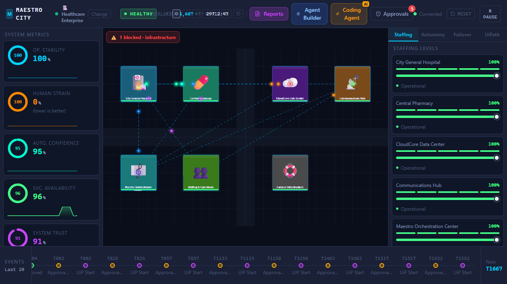
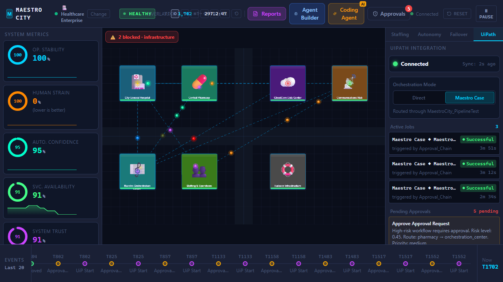
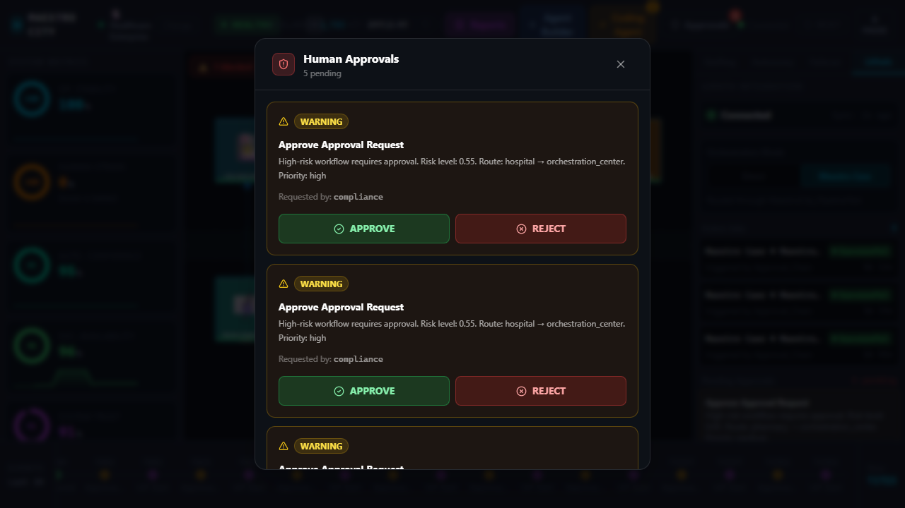

# Maestro City

**An autonomous enterprise-operations simulator where five AI agents keep a digital city running — orchestrated end-to-end through UiPath.**

Built for the [UiPath AgentHack](https://uipath-agenthack.devpost.com/) (Track 1 — Maestro Case). When a system fails, the agents reason over the situation using **UiPath's LLM Gateway**, fire **real Orchestrator jobs**, and gate high-risk actions behind **human approval** — either as individual processes or as a single **Maestro Case** instance, toggleable live in the UI.

---

## Try it live (for judges)

**▶ Live app: https://uipath-simcity-enterprise-frontend-atzzwsft0.vercel.app/**

Frontend on **Vercel**, backend on **Render**, and all agents + orchestration on **UiPath Automation Cloud**. Pick a scenario (e.g. **Healthcare**) → trigger an outage → watch the agents fire **real UiPath jobs**, flip **Direct → Maestro Case**, action the **human approval**, and open **Reports**. (Same beats as the [judging walkthrough](#setup--run--step-by-step-for-judging) below.)


*The live dashboard — system metrics, the city dependency graph, and a real-time event stream of UiPath job starts and approvals.*

> ⚠️ **First load may take ~50 seconds.** The backend runs on Render's **free tier**, which **sleeps after ~15 minutes of inactivity** and cold-starts on the next request. If the app shows **"Offline / Connecting"** or no data at first, **wait ~a minute and refresh** — it's waking up, not broken. (Tip: open the app a minute before reviewing so it's warm.)
>
> Requires JavaScript enabled. Prefer to run it yourself? The **[Setup & run](#setup--run--step-by-step-for-judging)** section below works fully locally.

---

## What it does


*Seven enterprise verticals out of the box — each with its own systems, agents, and compliance frameworks (HIPAA, SOX, PCI-DSS, NERC CIP, FAA Part 139…) — plus a natural-language **Create Custom Scenario** generator.*

- A live "city" of enterprise systems (EHR, data center, pharmacy, comms, …) runs on a real-time tick loop.
- Five role-based agents — **APEX** (executive strategy), **SENTINEL** (incident response), **VERITAS** (compliance), **ECHO** (communications), **ARIA** (operations) — monitor the city and act within configurable **autonomy levels**.
- When an outage hits, agents start **real UiPath jobs** on serverless robots. Coded agents reason with **gpt-4.1-mini through UiPath's LLM Gateway** (no direct OpenAI calls).
- High-risk actions are **gated for human approval**; the Maestro Case delivers the approval task to Action Center.
- A **Coding Agent** and **custom-scenario generator** also run on UiPath robots — generating XAML workflows and new scenarios from natural language.

> **No silent fallbacks.** If UiPath or the LLM is unavailable, failures surface in the UI (a `Faulted` job, an error toast) rather than being faked. You always know whether it really ran.

---

## Agent Type

> **Coded Agents** — orchestrated by a **low-code UiPath Maestro Case**.
>
> Read strictly ("what kind of agents do the AI reasoning?") the answer is **Coded Agents**: all five operational agents, plus the Coding Agent and the scenario generator, are UiPath Coded Agents. The solution *also* uses a **low-code Maestro Case** (`MaestroCity_PipelineTest`) for orchestration and the human-approval gate — so end-to-end it combines **Coded Agents + a low-code Maestro Case** (the Track 1 centerpiece).

Every AI agent in Maestro City is a UiPath Coded Agent — authored with the uipath-langchain SDK as a LangGraph graph, published with the uipath CLI, and run on serverless Automation Cloud Robots, reasoning through the UiPath LLM Gateway (gpt-4.1-mini). There are no direct OpenAI/model-vendor calls anywhere in the codebase. This includes:

- the five operational agents — APEX, SENTINEL, VERITAS, ECHO, ARIA; - the Coding Agent (coding_gen) that generates/patches UiPath XAML; and - the scenario generator (scenario_gen) that builds new scenarios from natural language.

These coded agents are orchestrated by a low-code Maestro Case (MaestroCity_PipelineTest) with a human-approval gate delivered to Action Center. So: the agents are Coded; the orchestration + human gate layer is low-code Maestro. Agent source lives in _uipath_build/.

---

## Why an enterprise would actually use this

The city is the demo vehicle. The **sellable asset is the agentic incident-response layer underneath it** — the UiPath coded agents, the Orchestrator runbooks, and the Maestro Case with human-approval gates. **Maestro City is the rehearsal-and-validation environment for that layer.**

> You wouldn't put an AI agent in charge of your incident response without testing it first — but there's no safe place to test autonomous, cross-system crisis response. Maestro City is that place. The **same** coded agents and Orchestrator runbooks that would run in production get stress-tested against cascading-failure scenarios — with human-approval gates proven out — before they ever touch a real system.

It lands in budget lines enterprises already fund:

| Existing budget | What Maestro City extends it to |
|---|---|
| Disaster-recovery drills / tabletop exercises | …exercising **AI agents that take autonomous action**, not just human runbooks |
| Chaos engineering (Gremlin, AWS FIS) | …at the **business-process / orchestration** layer, not just infrastructure |
| SOC / NOC operator training | …rehearsing **cross-functional cascade response** in one pane of glass |

**This is not hypothetical.** Recent cascading failures — the AWS region outage, Change Healthcare (~$2.3B response), Ascension (~$1.3B), TSB (£330M) — are the bill for an *unrehearsed* response. Modern operations fail as networks, vendors, payments, cloud regions, identity, staffing, and recovery workflows cascade together. Every one of those is a scenario you can rehearse here.

---

## Orchestration modes

A switch in the **UiPath Integration** panel flips how agent actions reach UiPath:

| Mode | Behavior |
|------|----------|
| **Direct** | Each agent fires its own Orchestrator process (`Incident_Escalation`, `Approval_Chain`, …). |
| **Maestro Case** | Agent actions are routed into a single **`MaestroCity_PipelineTest`** Maestro Case instance that orchestrates the agents + human approval. A burst of actions during one outage collapses into one Case instance. |

Default is set by `UIPATH_ORCHESTRATION_MODE` (`direct` | `maestro`) and can be changed at runtime.


*The UiPath panel during a live run: connected, in Maestro Case mode, with real Orchestrator jobs succeeding and approvals queued.*

---

## Human-in-the-loop approvals

When **VERITAS** (the compliance agent) sees a compliance-sensitive workflow during a crisis, it **holds it for human approval** instead of letting it run. Pending approvals surface in the **Human Approvals** modal (top bar) and the **UiPath** sidebar panel; both Approve/Reject buttons call the real `/api/approvals/{id}/approve|reject` endpoints. In **Maestro Case** mode the same gate is also delivered to **UiPath Action Center**.


*The Human Approvals modal — each card shows the risk level, route, and priority; Approve/Reject call real backend endpoints (and Action Center in Maestro mode).*

**What gets gated:** any workflow typed `approval_request` (compliance-sensitive by definition), or any workflow whose risk exceeds `0.7`.

**How the queue stays manageable** (so you're not click-spammed):

- **Dedupe** — at most one pending approval per workflow.
- **Queue cap** — at most **5** pending VERITAS approvals at once; new ones wait until some are resolved.
- **Auto-expire** — approvals past their 5-minute SLA are dropped automatically.
- **Decided = done** — once you approve or reject a workflow, it is **never re-gated**.
- **Cooldown** — after *any* human decision, VERITAS pauses creating new approvals for `UIPATH_APPROVAL_COOLDOWN_SECONDS` (default **45s**), so clearing the queue actually sticks instead of instantly refilling. Once the cooldown elapses, an ongoing crisis may surface a few new approvals (ongoing crisis = ongoing oversight).

The Human Approvals modal contains **only genuine approval decisions** — critical alerts are deliberately **not** mixed into it (that previously created an un-clearable treadmill). The modal reports the unacknowledged-critical *count* so the UI can badge "N in Alert Feed →", but the full alert stream lives in the **Alert Feed**, not the approvals queue.

---

## Failure behavior — no silent fallbacks

Both orchestration modes are **fail-forward**: if UiPath is unconfigured, a release isn't published, auth fails, or a job faults, the UI shows a **Faulted job with the real reason** and the API returns a true `502/503` — it never fakes a successful run. Failed player actions (e.g. activating failover with no backup building in the scenario) surface as a warning **alert** rather than silently doing nothing. You can always tell whether automation actually ran.

---

## Exports — what they are and where they go

The **Coding Agent** (top bar), the **Debug Workflow** tab, and the **Reports** modal all produce downloadable artifacts. They split into two kinds: **things you import into UiPath Studio and publish to Orchestrator**, and **human-facing documents**.

| Export | What it is | Where it goes / how to use it |
|--------|------------|-------------------------------|
| **Reports → Process Templates → Download** | Per-process `Main.xaml` + `project.json` for the five response processes (`Incident_Escalation`, `Crisis_Response`, `Approval_Chain`, `Emergency_Staffing`, `Trust_Recovery_Protocol`). Hand-structured, demo-ready. | Put both files in a folder, open it as a project in **UiPath Studio** (or `uipath pack`), then **publish to Orchestrator**. These are the exact processes the agents trigger at runtime. |
| **Coding Agent → Download XAML** | A `workflow.xaml` generated *live* from the current crisis by the `coding_gen` robot (gpt-4.1-mini via the LLM Gateway). | Import into **UiPath Studio** and **publish to Orchestrator**, same as above. It's LLM-generated, so treat it as a starting point that may need cleanup before it runs. |
| **Debug Workflow → suggested fix / XAML patch** | A root-cause diagnosis plus a corrected **XAML fragment** for a faulted workflow. | **Not** a full import — paste the patch into your *existing* workflow in Studio and apply the listed remediation steps. |
| **Reports → After-Action Report → Download JSON** | Incident retrospective: timeline, metrics, and what each agent did. | A **deliverable** — file or share it (incident review, post-mortem). Not a UiPath import. |
| **Reports → Runbook → Download .md / .json** | An operational runbook for responders, generated from the run. | **Documentation** for the ops / SOC team. Not a UiPath import. |
| **Reports → Calibration Score** | An autonomy-calibration certificate — evidence the agents acted at appropriate trust/autonomy levels. | **Governance / compliance artifact.** Not a UiPath import. |

> **Note:** these buttons are browser downloads — the import-and-publish step into UiPath Studio / Orchestrator is **manual**. (Separately, the running agents *do* start jobs on already-published processes via the Orchestrator API — that's the live integration; these exports are the "author new automation" side.)

---

## Architecture


```
apps/frontend   Next.js 14 (App Router) + PixiJS city renderer + Zustand   → Vercel
apps/backend    FastAPI + WebSocket + Pydantic, real-time tick loop        → Railway / Render
packages/shared-types   TypeScript types shared via the @shared/* path alias
_uipath_build   Coded-agent source + publishing scripts (uipath CLI / uipcli)
```

The backend is **stateful** (in-memory simulation + a WebSocket broadcast loop), so it must run on a long-lived host — **not** a serverless function.

---

## UiPath components used

> **Verified live against the tenant on 2026-06-29** — org `hackathon26_313` / tenant `DefaultTenant`, folder **`MaestroCity`** (id `3084969`). Every name below is a real published object in Orchestrator, queried via the OData API — not a placeholder. **Totals: 2 folders · 18 published processes** = 1 Maestro Case + 7 Coded Agents + 5 agent-invocation processes + 5 response workflows.

### Platform & auth
- **External Application** — OAuth2 **client-credentials**; granted scopes `OR.Jobs OR.Execution OR.Folders OR.Tasks`.
- **Orchestrator** — folders `MaestroCity` (id `3084969`) + `Shared` (id `3042878`); Releases + Packages; `StartJobs` (OData) and job-status polling.
- **Serverless Automation Cloud Robots** — every job runs `Strategy: ModernJobsCount`, `RuntimeType: Serverless`.
- **LLM Gateway** — all agent reasoning (gpt-4.1-mini); no direct OpenAI/model-vendor calls anywhere.
- **Action Center** — receives the human-in-the-loop approval task in Maestro Case mode.

### Maestro Case — low-code orchestration (Track 1 centerpiece)
| Release | Version |
|---|---|
| `MaestroCity_PipelineTest` | 1.0.3 |

Rule-driven case that folds a burst of agent actions into one instance and gates compliance-sensitive steps behind an **Action Center** approval.

### Coded Agents — `uipath-langchain` / LangGraph, reasoning via the LLM Gateway
| Coded agent (package) | Version | Role |
|---|---|---|
| `apex` | 1.0.2 | Executive strategy |
| `aria` | 1.0.2 | Operations coordination |
| `sentinel` | 1.0.2 | Incident response |
| `veritas` | 1.0.2 | Compliance / approval gating |
| `echo` | 1.0.2 | Communications |
| `coding_gen` | 1.0.0 | Generates / patches UiPath XAML from the live crisis |
| `scenario_gen` | 1.0.0 | Builds new scenarios from natural language |

### Agent-invocation processes the backend triggers via `StartJobs`
`APEX_Executive_Strategy`, `ARIA_Operations_Coordinator`, `SENTINEL_Incident_Response`, `VERITAS_Compliance`, `ECHO_Communications` — all v1.0.0. These are the exact Release names mapped in [`orchestration/uipath_client.py`](apps/backend/orchestration/uipath_client.py) → `_DEFAULT_AGENT_PROCESSES`.

### Response-workflow processes — the 5 runbooks agents fire (importable XAML)
`Incident_Escalation`, `Crisis_Response`, `Approval_Chain`, `Emergency_Staffing`, `Trust_Recovery_Protocol` — all v1.0.0.

See [docs/UIPATH_PLATFORM_SETUP.md](docs/UIPATH_PLATFORM_SETUP.md) and [docs/AGENT_BUILDER_SPEC.md](docs/AGENT_BUILDER_SPEC.md) for the full setup.

---

## Setup & run — step-by-step (for judging)

**Prerequisites**
- **Node 18+** and **Python 3.11+** (and `git`).
- A **UiPath Automation Cloud tenant** with an **External Application** (OAuth2 client-credentials) — only needed to see *real* jobs. The app also runs without it (UiPath calls then show as unavailable/Faulted in the UI — never faked).
- *(Rebuilding/republishing the UiPath packages is **not** required to run or judge — the agents, processes, serverless robot, and Maestro Case are already published in the tenant. Re-publishing only needs the `uipath` CLI + `uipcli` + .NET 8.)*

**1 · Clone & install**
```bash
git clone https://github.com/visprogithub/uipath_simcity_enterprise.git
cd uipath_simcity_enterprise
npm run install:all          # frontend deps + backend pip deps
```

**2 · Configure UiPath credentials**
```bash
cp apps/backend/.env.example apps/backend/.env
```
Fill in the six required values (full table below). Where each comes from:
| Value | Where to find it |
|-------|------------------|
| `UIPATH_CLOUD_URL` | Your tenant base, e.g. `https://cloud.uipath.com` (this project's tenant: `https://staging.uipath.com`) |
| `UIPATH_ORGANIZATION` / `UIPATH_TENANT` | The two path segments in your Orchestrator URL: `…/<org>/<tenant>/orchestrator_` |
| `UIPATH_CLIENT_ID` / `UIPATH_CLIENT_SECRET` | **Admin → External Applications** → your app (scopes: `OR.Jobs OR.Execution OR.Folders OR.Tasks`). **Single-quote the secret in `.env`** if it contains `$`, `%`, `#`, etc. |
| `UIPATH_FOLDER_ID` | Orchestrator → your folder → the `fid` in its URL (this project: the `MaestroCity` folder) |

> For this submission the UiPath objects are already published in the hackathon tenant (`hackathon26_313` / `DefaultTenant`, folder `MaestroCity`). A judge only needs External-Application credentials for that tenant to drive real jobs.

**3 · (optional) point the frontend at the backend**
```bash
cp apps/frontend/.env.example apps/frontend/.env.local   # NEXT_PUBLIC_BACKEND_URL defaults to http://localhost:8000
```

**4 · Run both servers**
```bash
npm run dev          # runs backend (uvicorn :8000) + frontend (next :3000) concurrently
# or individually: npm run dev:backend  /  npm run dev:frontend
```
Open **<http://localhost:3000>** (backend health: <http://localhost:8000/api/orchestration/mode>).

**5 · 2-minute judging walkthrough**
1. **Pick a scenario** — click **Launch Simulation** on **Healthcare Enterprise** (cleanest cascade story).
2. **Trigger a crisis** — right panel → **Failover** tab → **Trigger Outage** on the *Cloud / Data Center* (severity *full*). Watch buildings cascade and the **Alert Feed** fill.
3. **See real UiPath jobs** — right panel → **UiPath** tab → the **Active Jobs** list populates (`Incident_Escalation`, `Crisis_Response`, …). Cross-check the same jobs in your **Orchestrator → Jobs** view to confirm they're real.
4. **Direct → Maestro Case** — flip the **Orchestration Mode** toggle in the UiPath panel; agent actions now route into one **`MaestroCity_PipelineTest`** Maestro Case instance.
5. **Human approval** — top bar → **Approvals**; approve/reject a VERITAS-gated action (in Maestro mode the task also appears in **Action Center**).
6. **Autonomy / staffing dials** — right panel → **Autonomy** tab → change an agent's level (e.g. SENTINEL → 3 auto-failover, VERITAS → 1 holds for approval).
7. **Exports** — top bar → **Reports** → step through **After-Action / Runbook / Calibration / Templates** and hit **Download**.
8. **Coding Agent (bonus)** — top bar → **Coding Agent** → **Generate Workflow** (XAML from the live crisis) and the **Debug** tab (diagnose + patch).

**Troubleshooting**
- *Port already in use* — stop any process on `8000`/`3000` and re-run.
- *UiPath panel shows "Offline" / jobs Faulted* — credentials aren't set or the tenant is unreachable; the app surfaces this honestly (no fake success). Recheck the six env values.
- *Secret looks corrupted at runtime* — wrap `UIPATH_CLIENT_SECRET` in single quotes in `.env`.

---

## Environment variables

### Where credentials go — read this first

There are **exactly two** env files the app reads, each holding different things, plus their **deployed equivalents** in the host dashboards. Nothing else is read.

| Scope | Local file | Deployed home | Holds |
|-------|-----------|---------------|-------|
| **Backend** | `apps/backend/.env` | **Render** dashboard → Environment | UiPath secrets (`UIPATH_CLIENT_ID`, `UIPATH_CLIENT_SECRET`, tenant, folder, …) |
| **Frontend** | `apps/frontend/.env.local` | **Vercel** project → Environment Variables | `NEXT_PUBLIC_BACKEND_URL`, `NEXT_PUBLIC_WS_URL` |

> ⚠️ **There is no repo-root `.env`.** The backend calls `load_dotenv()` while running from `rootDir: apps/backend`, so it loads **`apps/backend/.env`** — a `.env` at the repo root is **not** read by anything. If you keep a scratch file there, don't trust it as the source of truth; the authoritative UiPath secret is the `UIPATH_CLIENT_SECRET` in `apps/backend/.env`. When deploying, copy *that* value into Render — not whatever happens to sit at the repo root.

> ⚠️ **`NEXT_PUBLIC_*` is baked in at build time.** Next.js inlines these into the bundle when it builds, so the deployed frontend only reaches the backend if `NEXT_PUBLIC_BACKEND_URL` was set in Vercel **before** the build. Changing it requires a **redeploy** — a plain "save variable" won't re-inline it. If the live site is calling `http://localhost:8000`, this is why.

### Backend (`apps/backend/.env`)

| Variable | Required | Description |
|----------|----------|-------------|
| `UIPATH_CLOUD_URL` | yes | Tenant base URL, e.g. `https://cloud.uipath.com` |
| `UIPATH_ORGANIZATION` | yes | Organization (account-logical) name |
| `UIPATH_TENANT` | yes | Tenant name, e.g. `DefaultTenant` |
| `UIPATH_CLIENT_ID` | yes | External Application client ID |
| `UIPATH_CLIENT_SECRET` | yes | External Application client secret (**single-quote in `.env`** if it contains special chars) |
| `UIPATH_FOLDER_ID` | yes | Orchestrator folder (organization-unit) ID |
| `UIPATH_WEBHOOK_SECRET` | no | HMAC-SHA256 secret used to verify inbound Orchestrator webhooks. Only needed if you wire up webhooks (set it when creating the webhook in Orchestrator). |
| `UIPATH_ORCHESTRATION_MODE` | no | `direct` (default) or `maestro` |
| `UIPATH_MAESTRO_CASE_PROCESS` | no | Maestro Case release name (default `MaestroCity_PipelineTest`) |
| `UIPATH_MAESTRO_COOLDOWN_SECONDS` | no | Dedupe window for Maestro Case starts (default `25`) |
| `UIPATH_APPROVAL_COOLDOWN_SECONDS` | no | After a human approve/reject, seconds VERITAS waits before creating new approvals (default `45`) |

If credentials are absent, the app runs but UiPath calls report as unavailable in the UI (no faked success).

### Frontend (`apps/frontend/.env.local`)

| Variable | Description |
|----------|-------------|
| `NEXT_PUBLIC_BACKEND_URL` | Backend base URL (e.g. `https://your-backend.up.railway.app`) |
| `NEXT_PUBLIC_WS_URL` | WebSocket URL (defaults to the backend URL with `ws(s)://…/ws`) |

---

## Deploy

### Backend → Railway or Render

**Railway:** New Project → Deploy from repo → set **Root Directory** to `apps/backend` (picks up [`apps/backend/railway.json`](apps/backend/railway.json) / [`Procfile`](apps/backend/Procfile)). Add the UiPath env vars under Variables. Railway injects `$PORT`.

**Render:** New → Blueprint, pointed at [`render.yaml`](render.yaml). Fill the `sync: false` UiPath vars in the dashboard.

Either way the start command is:

```bash
uvicorn main:app --host 0.0.0.0 --port $PORT
```

### Frontend → Vercel

New Project → set **Root Directory** to `apps/frontend` (the `@shared/*` alias resolves against the cloned repo). Add:

- `NEXT_PUBLIC_BACKEND_URL` = your deployed backend URL
- `NEXT_PUBLIC_WS_URL` = `wss://<backend-host>/ws`

[`apps/frontend/vercel.json`](apps/frontend/vercel.json) sets the framework preset.

---

## Security

- **Secrets live only in `.env` / the host dashboard** — every `.env` is gitignored; only `.env.example` placeholders are committed.
- Rotate the UiPath client secret before sharing the repo publicly.
- Never commit `apps/backend/.env` or any `_uipath_build/**/.env` (all ignored by the bare `.env` rule).

---

## Project structure

```
apps/
  backend/          FastAPI app, simulation engine, agents, UiPath client
    agents/         APEX / SENTINEL / VERITAS / ECHO / ARIA decision logic
    orchestration/  uipath_client.py, agent_invoker.py, template generator
    scenarios/      slot-factory scenario specs + registry
    api/            REST routes, WebSocket, coding agent, scenario generator
  frontend/         Next.js + PixiJS UI
packages/
  shared-types/     shared TS types
docs/               UiPath setup, agent specs, coding-agent guide
```
